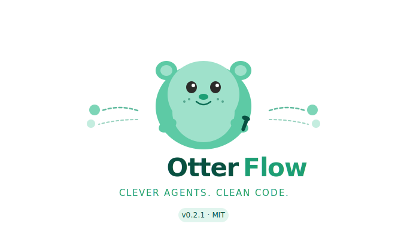

# 🦦 OtterFlow

<div align="center">
  
</div>

**Build production-ready AI agents in 10 lines of Python.**

[](https://pypi.org/project/otterflow/)
[](https://www.python.org/downloads/)
[](https://opensource.org/licenses/MIT)
[]()

`OtterFlow` is a minimal, composable framework for building multi-step AI agents powered by [Claude](https://anthropic.com/claude). No bloat. No magic. Just agents that work.

```python
from otterflow import Agent
from otterflow.tools import web_search, calculator

agent = Agent(
    name="FinanceBot",
    role="You are a financial research assistant.",
    tools=[web_search, calculator],
)

print(agent.run("What's NVIDIA's latest revenue? Calculate 15% YoY growth."))
```

---

## Why OtterFlow?

Most agent frameworks are either toy demos or enterprise nightmares. `otterflow` is neither.

| | OtterFlow | LangChain | AutoGen |
|---|---|---|---|
| Lines to a working agent | **~10** | ~50 | ~40 |
| Multi-agent orchestration | ✅ | ✅ | ✅ |
| Built-in business agents | ✅ | ❌ | ❌ |
| Zero magic / full control | ✅ | ❌ | ❌ |
| Persistent memory | ✅ | ✅ | ✅ |
| Custom tools in 3 lines | ✅ | ❌ | ❌ |

---

## Install

```bash
pip install otterflow
```

Then set your Anthropic API key. The easiest way is a `.env` file in your project root:

```bash
cp .env.example .env
# then open .env and paste your key
```

Or export it directly in your shell:

```bash
export ANTHROPIC_API_KEY="your-key-here"
```

Get a key at [console.anthropic.com](https://console.anthropic.com/).

---

## Core Concepts

### 1. Agent — the building block

```python
from otterflow import Agent

agent = Agent(
    name="Analyst",
    role="You are a senior business analyst. Be concise and data-driven.",
    verbose=True,   # streams tool call logs to stdout
)

result = agent.run("Summarize the current state of the AI chip market.")
print(result)
```

### 2. Streaming — real-time output

```python
agent = Agent("Writer", "You are a sharp business writer.")

for chunk in agent.stream("Write a 3-paragraph brief on the AI chip market."):
    print(chunk, end="", flush=True)

print()  # newline after stream ends
```

Works with tools too — tool-call steps run silently between turns, and only the final text response is streamed to the caller.

### 3. Async — non-blocking, production-ready

```python
import asyncio
from otterflow import Agent

agent = Agent("Bot", "You are a research assistant.", tools=[web_search])

# Single async call
result = await agent.arun("What are the top AI infrastructure startups?")

# Run multiple agents concurrently — both fire at the same time
results = await asyncio.gather(
    agent1.arun("Research the US EV market."),
    agent2.arun("Research the EU EV market."),
)
```

### 4. Pipe operator — chain agents

```python
from otterflow import Agent
from otterflow.agents import ResearchAgent

researcher = ResearchAgent()
writer = Agent("Writer", "Turn research into a sharp, structured report.")
editor = Agent("Editor", "Tighten copy. Cut filler. Keep it punchy.")

# Build a pipeline with |
pipeline = researcher | writer | editor

# Each agent's output becomes the next agent's input
result = pipeline.run("What's the state of the B2B AI market in 2025?")
print(result)
```

Async pipelines work the same way:

```python
result = await pipeline.arun("What's the state of the B2B AI market in 2025?")
```

### 5. Token tracking — know your costs

```python
agent = Agent("Researcher", "You research topics.", tools=[web_search])
agent.run("Summarize the latest AI chip news.")

print(agent.usage)
# Usage(input=3,241, output=892, ~$0.0231)

print(agent.usage.estimated_cost_usd)   # 0.0231
print(agent.usage.total_tokens)         # 4133
```

Usage accumulates across all `.run()` / `.arun()` / `.stream()` calls on the same agent instance.

### 6. Tools — give your agent superpowers

otterflow ships with 7 built-in tools:

```python
from otterflow.tools import (
    web_search,     # searches the web for current info
    read_file,      # reads local files
    write_file,     # writes output to disk (system paths are blocked)
    run_python,     # executes Python snippets in an isolated subprocess
    calculator,     # evaluates math expressions safely
    memory_store,   # stores key-value pairs
    memory_recall,  # recalls stored values
)

agent = Agent(
    name="ResearchBot",
    role="You research topics and save reports.",
    tools=[web_search, write_file],
)

agent.run("Research the top 3 AI coding assistants and save a report to report.md")
```

### 7. Custom tools — 3 lines

```python
from otterflow.tools import tool

@tool(description="Fetch the current price of a stock ticker.")
def get_stock_price(ticker: str) -> str:
    import yfinance as yf
    return str(yf.Ticker(ticker).fast_info.last_price)

agent = Agent("Trader", "You track stocks.", tools=[get_stock_price])
agent.run("What's Apple trading at?")
```

### 8. Memory — agents that remember

```python
from otterflow import Agent, Memory

memory = Memory(max_turns=20)
memory.remember("client_name", "Acme Corp")
memory.remember("deal_value", "$120k")

agent = Agent("SalesBot", "You are a sales assistant.", memory=memory)

agent.run("Help me prep for tomorrow's renewal call.")
agent.run("What objections should I prepare for given the deal size?")
# ↑ Agent remembers the deal value from the previous turn
```

### 9. Multi-agent orchestration

Spawn sub-agents and let a parent orchestrator delegate tasks:

```python
from otterflow import Agent
from otterflow.tools import web_search, write_file

# Specialist agents
researcher = Agent("Researcher", "Deep research specialist.", tools=[web_search])
writer = Agent("Writer", "Turn research into polished reports.", tools=[write_file])

# Orchestrator spawns both as tools it can call
orchestrator = Agent("Boss", "Delegate and synthesize.")
orchestrator.spawn(researcher)
orchestrator.spawn(writer)

# Single call routes through both agents automatically
orchestrator.run(
    "Research the EV market and write a 1-page executive brief to ev_brief.md"
)
```

---

## Pre-built Business Agents

Drop these into your app immediately:

```python
from otterflow.agents import (
    ResearchAgent,          # Deep web research + structured reports
    EmailAgent,             # Draft, rewrite, and improve emails
    DataAnalystAgent,       # Reads files, runs Python, surfaces insights
    CompetitiveIntelAgent,  # Competitor battle cards
    ContentCreatorAgent,    # Platform-specific content coaching + rewrites
    BusinessIntelPipeline,  # All of the above, orchestrated
)
```

### ResearchAgent

```python
researcher = ResearchAgent(verbose=True)
report = researcher.run(
    "What are the top 5 B2B SaaS trends for 2025? Focus on AI and pricing."
)
```

### EmailAgent

```python
email_bot = EmailAgent(tone="assertive")
draft = email_bot.run(
    "Write a follow-up to a prospect who went cold after last week's demo."
)
```

### ContentCreatorAgent

```python
coach = ContentCreatorAgent(platform="LinkedIn")

feedback = coach.run("""
    Analyze this post:

    Excited to share that I've been thinking a lot about leadership lately.
    Great leaders listen to their teams. What do you think? Like and follow!
""")

# In the next turn, the agent remembers what it already critiqued
rewrite = coach.run("Now rewrite it using what you just taught me.")
```

Supports `"LinkedIn"`, `"Twitter/X"`, and `"Newsletter"` — each with platform-specific rules
for hook quality, formatting, engagement triggers, and CTAs.

### BusinessIntelPipeline

```python
pipeline = BusinessIntelPipeline(verbose=True)
analysis = pipeline.run(
    "Should I build a B2B AI sales coaching product in 2025? "
    "Analyze market size, competitors, and give me a go/no-go."
)
```

---

## Real-world example: content coach with memory

`OtterFlow` agents remember context across turns — so feedback from turn one informs the rewrite in turn two, just like working with a real editor.

```python
from otterflow import Memory
from otterflow.agents import ContentCreatorAgent

# Load user context into memory
memory = Memory()
memory.remember("author", "Jordan")
memory.remember("niche", "B2B SaaS founders")
memory.remember("goal", "grow LinkedIn to 10k followers in 90 days")

coach = ContentCreatorAgent(platform="LinkedIn", memory=memory)

# First turn: critique
with open("draft_post.txt") as f:
    draft = f.read()

feedback = coach.run(f"Analyze this post for Jordan:\n{draft}")
print(feedback)

# Second turn: agent remembers the draft, the critique, and Jordan's goal
rewrite = coach.run("Now rewrite it.")
print(rewrite)
```

---

## Architecture

```
otterflow/
├── agent.py          # Core Agent class — tool loop, sub-agent spawning
├── memory.py         # Memory — sliding window, persistent facts
├── tools.py          # Tool class, @tool decorator, built-in tools
└── agents/
    └── __init__.py   # Pre-built business agents
```

The execution loop is deliberately transparent:

```
run(prompt)
  │
  ├─ inject memory + history into messages
  ├─ call Claude with tool specs
  │
  └─ loop:
      ├─ if stop_reason == "end_turn" → return text
      └─ else → execute tool calls → append results → repeat
```

No hidden chains. No mysterious abstractions. You can read the entire core in < 200 lines.

---

## Contributing

PRs welcome. High-value contributions:

- New built-in tools (Slack, email, calendar, Postgres)
- Async support (`agent.arun()`)
- Streaming output
- Token usage tracking
- More pre-built agents

```bash
git clone https://github.com/tabato/otterflow
cd otterflow
pip install -e ".[dev]"
pytest tests/
```

---

## License

MIT. Use it, fork it, build your startup on it.

---

*Built with [Claude](https://anthropic.com/claude) by Anthropic.*

